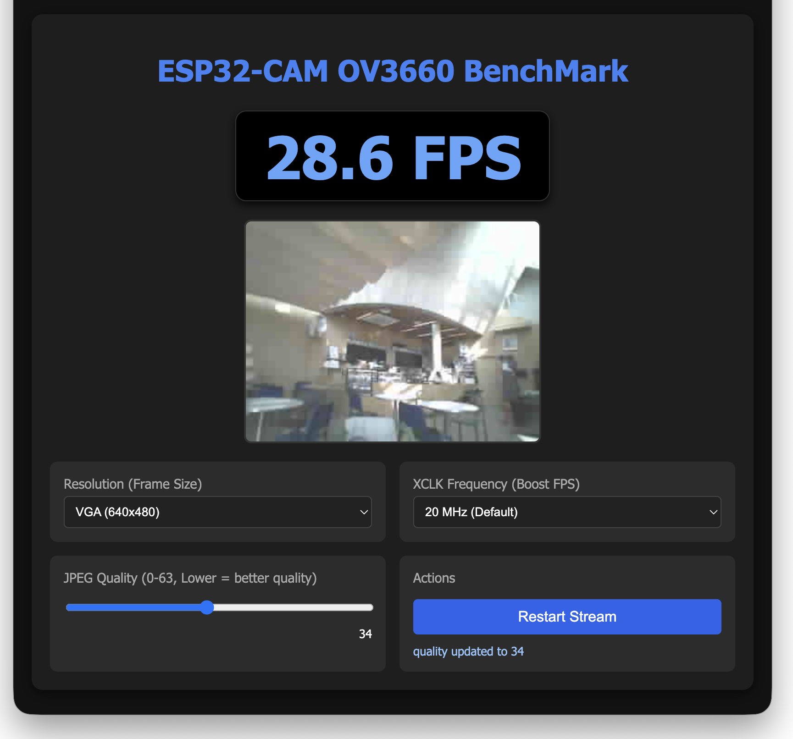

# ESP32-CAM OV3660 BenchMark 🚀

ESP32-CAM 보드와 OV3660 센서를 기반으로, 카메라의 실시간 프레임 레이트(FPS)를 측정하고 하드웨어 한계를 극한까지 테스트해 볼 수 있는 **전용 벤치마크 웹 대시보드** 애플리케이션입니다.



## 📌 주요 기능
- **실시간 FPS 모니터링:** 센서에서 데이터를 받아와 화면이 렌더링 되는 속도를 실시간으로 추적하여 표시합니다.
- **해상도 실시간 변경:** 96x96(매우 낮음) 해상도부터 UXGA(1600x1200) 고해상도까지 다양한 모드에서 FPS 비교가 가능합니다.
- **XCLK 오버클럭킹 테스트:** 기본 주파수인 20MHz뿐만 아니라, 10MHz부터 최대 24MHz까지 2 단위로 XCLK를 섬세하게 조작하며 보드에 맞는 한계 수율을 테스트할 수 있습니다.
- **스트림 화질 및 지연율 제어:** JPEG 압축 품질 슬라이더(10~63)를 손쉽게 조작하며 화질 vs FPS 교환(Trade-off) 비율을 확인할 수 있습니다.
- **최적화된 Dashboard UI:** 코딩 중 모니터링하기 적합한 시크하고 선명한 **Blue Theme / Dark Mode**가 적용되었으며, FPS 스코어를 독립적으로 보기 편하게 Center-Layout 되었습니다.

## 🛠️ 개발 환경 및 요구 사항
본 프로젝트는 Arduino IDE가 아닌 **PlatformIO (VS Code)** 환경을 기반으로 작성되었습니다.
- **Board:** `AI Thinker ESP32-CAM` (혹은 동급 ESP32 기반 카메라 보드)
- **Sensor:** `OV3660` (OV2640도 일부 호환되나 최고 FPS는 스펙에 따라 다름)
- **Platform:** `espressif32`
- **Framework:** `arduino`
- **통신:** 빠른 전송을 위해 전용 스트리밍 포트(Server Port + 1) 활용

## ⚙️ 설치 및 빌드 가이드
1. 프로젝트를 터미널 환경이나 VS Code (PlatformIO)에서 엽니다.
2. `include/secrets.h` 파일을 생성하거나 수정하여 **본인의 Wi-Fi SSID와 PASSWORD**를 입력하세요.
    ```cpp
    #define WIFI_SSID     "YOUR_WIFI_SSID"
    #define WIFI_PASSWORD "YOUR_WIFI_PASSWORD"
    ```
3. 케이블을 연결하고 업로드합니다.
   ```bash
   pio run -t upload
   ```
4. 업로드 완료 후, 시리얼 모니터에 표시되는 IP 주소를 확인합니다.
5. 브라우저에서 `http://[ESP_IP]/benchmark` 로 접속하세요.
   *사파리(Safari) 브라우저는 무한 스트리밍 포트를 Block할 수 있으므로, **Chrome 브라우저** 사용을 권장합니다.*

## 📈 벤치마크 테스트 방법론
1. **XCLK 조율:** 처음에 무작정 24MHz로 Boost하면 보드 수율에 따라 화면 하단부에 깨짐(초록색 줄, 가로줄 등)이 생길 수 있습니다. 기본 20MHz부터 시작해 점차 2 단위로 올려주세요.
2. **해상도 타겟 설정:** 초고속 모니터링이 필요하다면 QVGA 또는 QQVGA 이하로 스케일을 낮추어 보세요.
3. **병목 진단:** FPS가 원하는 만큼 나오지 않을 땐, 대역폭 한계인지 혹은 XCLK 동기화 문제인지 판단하기 위해 화질(Quality) 숫자를 높여 패킷 크기를 줄인 뒤 테스트하세요.

---
*Developed by Jinho Jung*
